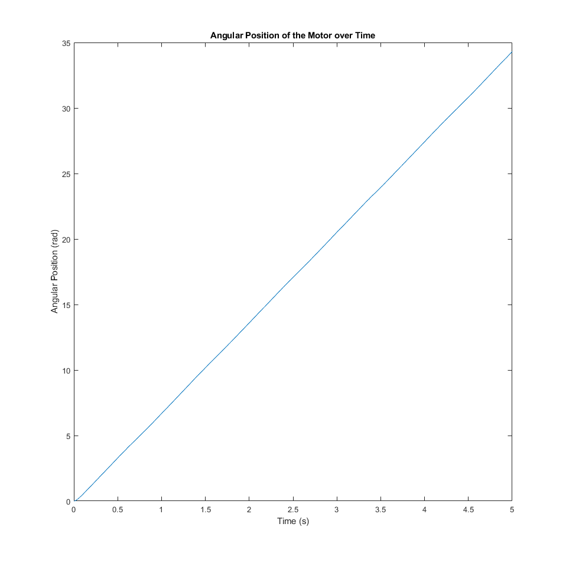
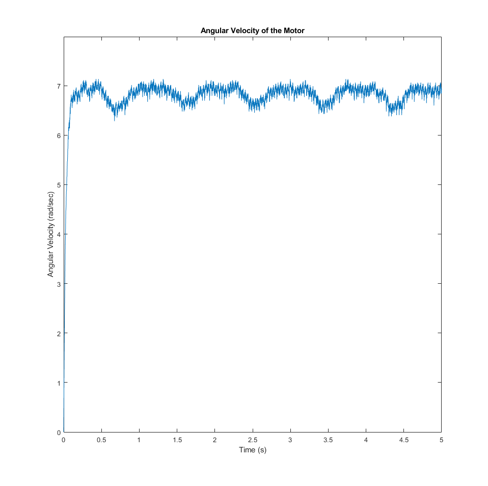
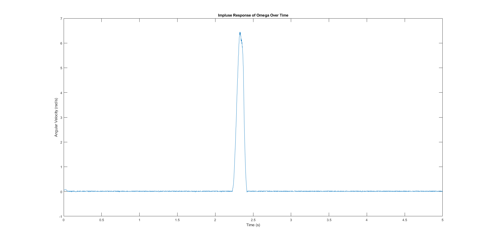
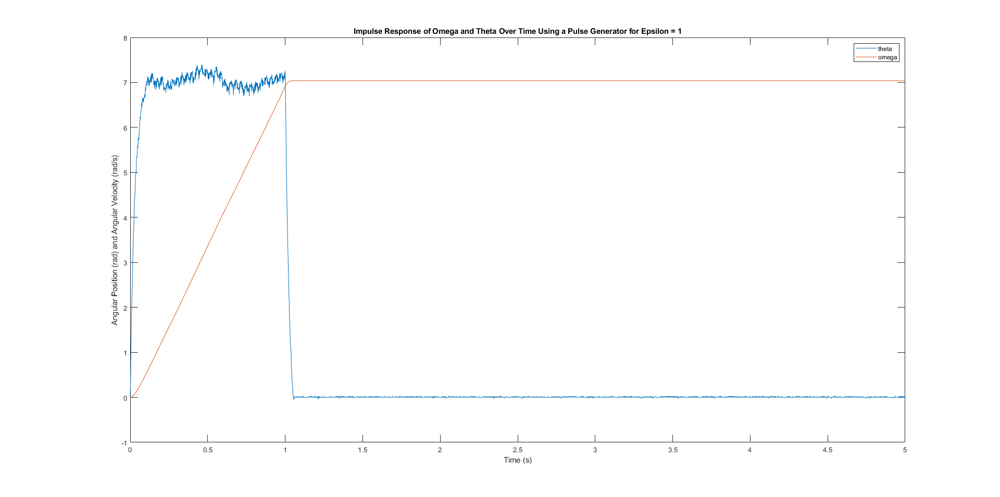

## MTHE 393: Engineering Design for Apple

[Lab 1](Lab1/): Controlling a basic servo motor and finding E_K and tao values for our angular differential equation

<table style="width: 100%; table-layout: fixed;">
  <tr>
    <td style="width: 50%;"></td>
    <td style="width: 50%;"></td>
  </tr>
</table>

[Lab 2](Lab2/): Impulse Response

<table style="width: 100%; table-layout: fixed;">
  <tr>
    <td style="width: 50%;"></td>
    <td style="width: 50%;"></td>
  </tr>
</table>
