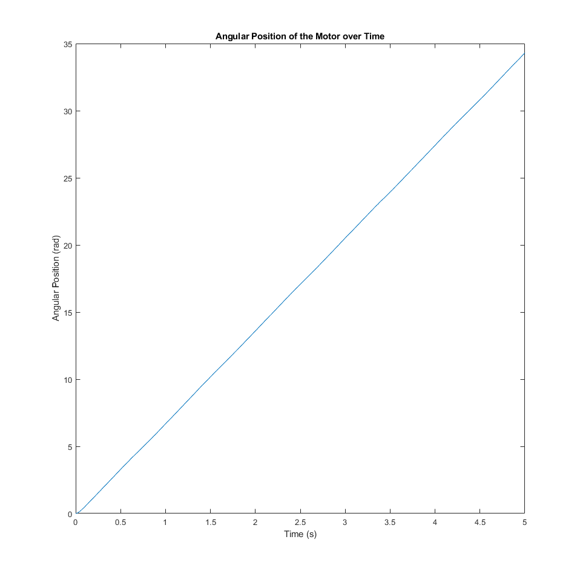
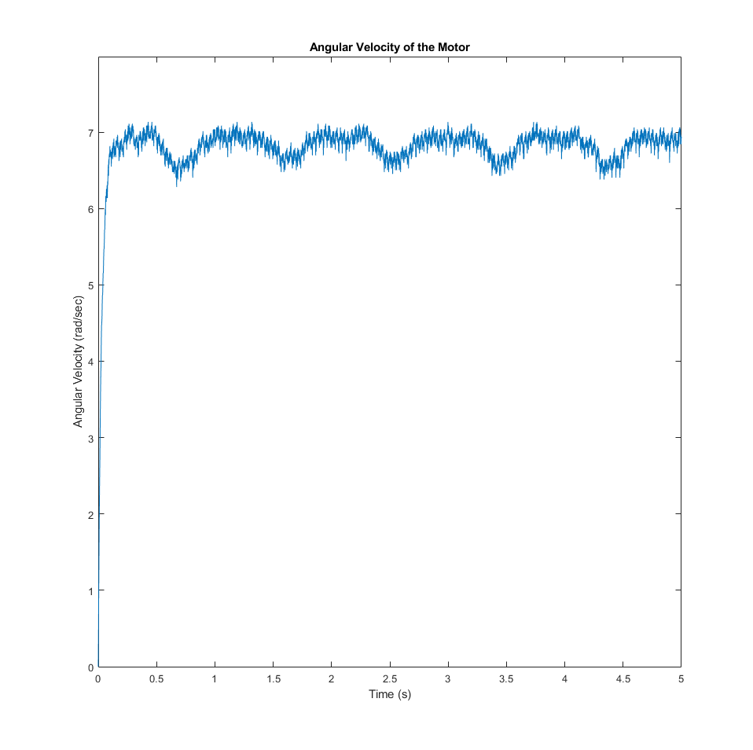
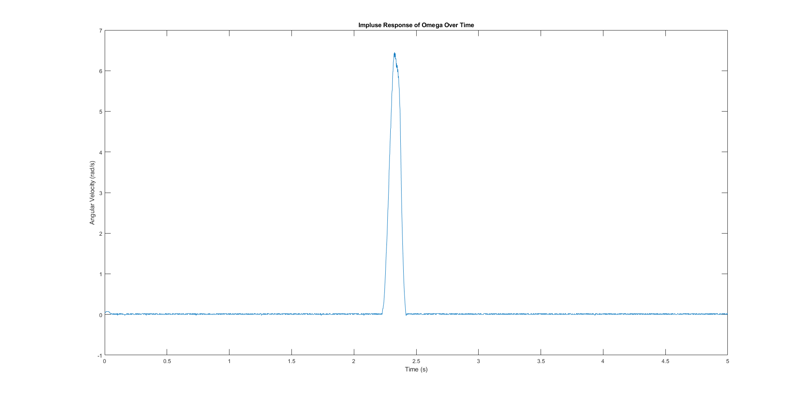

## MTHE 393: Engineering Design for Apple 

 [Lab 1](Lab1/): Controlling a basic servo motor and finding E_K and tao values for our angular differential equation 

 
 
    
    
 
 

 [Lab 2](Lab2/): Impulse Response. 

 

  
    
 

