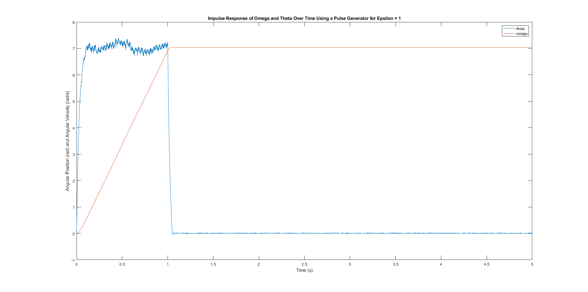

## MTHE 393: Engineering Design for Apple

[Lab 1](Lab1/): Controlling a basic servo motor and finding E_K and tao values for our angular differential equation

  
  

[Lab 2](Lab2/): Impulse Response

  
  

